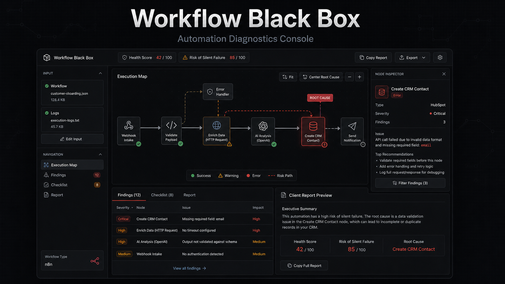
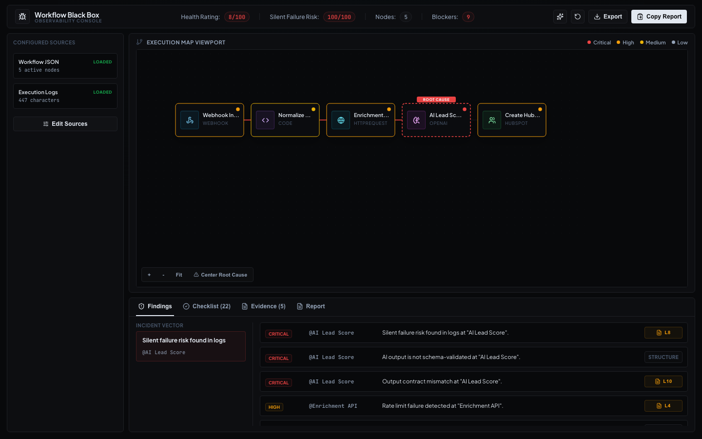
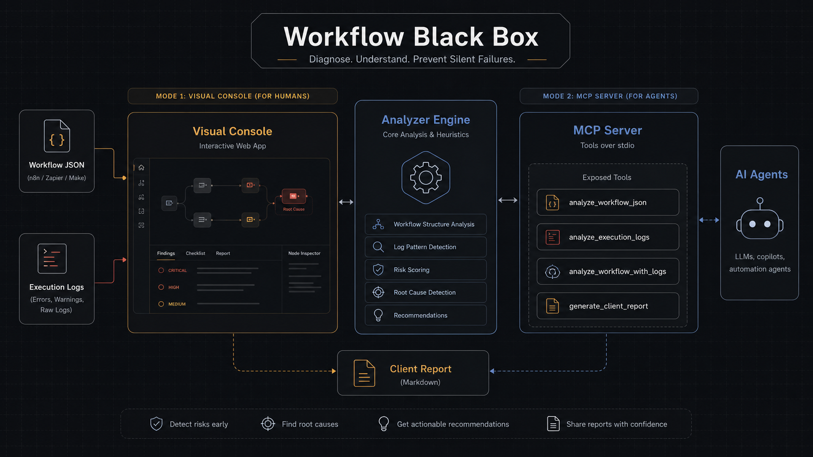

# Workflow Black Box

Consola web para diagnosticar automatizaciones de `n8n`, `Zapier` y `Make` a partir de workflows exportados y logs de ejecución.

<p align="center">
  
  
  
  
  
</p>



## Qué problema resuelve

Las automatizaciones no siempre fallan de forma obvia. Muchas veces un workflow termina como "exitoso", pero escribe datos incorrectos en un CRM, omite validaciones, duplica registros o rompe silenciosamente por una respuesta inesperada de una API.

Workflow Black Box ayuda a detectar esos riesgos antes de que lleguen al cliente:

- identifica nodos sospechosos;
- marca riesgos de `silent failure`;
- detecta falta de validaciones;
- encuentra errores comunes en logs;
- genera recomendaciones accionables;
- produce un informe listo para compartir con un cliente o equipo técnico.

## Funcionalidades

- Importación de workflow JSON.
- Importación o pegado de logs.
- Mapa visual de ejecución con estados de riesgo.
- Resaltado de root cause.
- Inspector interactivo por nodo.
- Filtro de findings al seleccionar un nodo.
- Checklist de recomendaciones.
- Reporte exportable y copiable.
- Diseño responsive sin overflow horizontal global.
- Pan/zoom básico del mapa para navegar workflows más grandes.

## Vista del producto



## Stack

- React
- TypeScript
- Vite
- Lucide React
- Playwright para validación visual

La app corre completamente en frontend. No requiere backend ni claves de API.

## Instalación

```bash
npm install
```

## Desarrollo

```bash
npm run dev
```

La app queda disponible en:

```text
http://127.0.0.1:5173
```

## Build de producción

```bash
npm run build
```

## Ejecutar con Docker

Construir la imagen:

```bash
docker build -t workflow-black-box .
```

Ejecutar el contenedor:

```bash
docker run --rm -p 8080:80 workflow-black-box
```

Abrir en el navegador:

```text
http://localhost:8080
```

## Uso como MCP para agentes

Workflow Black Box también expone su motor de diagnóstico como un servidor MCP por `stdio`. Esto permite que un agente use el analizador sin abrir la interfaz visual.



> Nota: la imagen Docker sirve el frontend estático. El servidor MCP se ejecuta localmente con Node usando `npm run mcp`.

Ejecutar el servidor MCP:

```bash
npm run mcp
```

Ejemplo de configuración para un cliente compatible con MCP:

```json
{
  "mcpServers": {
    "workflow-black-box": {
      "command": "npm",
      "args": ["run", "mcp", "--silent"],
      "cwd": "/ruta/al/proyecto/workflow-black-box"
    }
  }
}
```

Tools disponibles:

| Tool | Uso |
| --- | --- |
| `analyze_workflow_json` | Analiza un workflow JSON y detecta riesgos estructurales. |
| `analyze_execution_logs` | Analiza logs de ejecución, errores y suspicious successes. |
| `analyze_workflow_with_logs` | Cruza workflow + logs para encontrar root cause, findings y recomendaciones. |
| `generate_client_report` | Devuelve un informe conciso listo para compartir. |
| `list_supported_patterns` | Lista los patrones de riesgo detectados actualmente. |

## Cómo usarla

1. Exportá un workflow de n8n o pegá un JSON de ejemplo.
2. Pegá logs recientes de una ejecución fallida o sospechosa.
3. Revisá el mapa de ejecución.
4. Seleccioná un nodo para abrir el inspector.
5. Leé los findings y el checklist.
6. Copiá o exportá el informe para compartirlo.

## Qué analiza actualmente

El motor de análisis detecta patrones como:

- webhooks sin autenticación evidente;
- llamadas HTTP sin retry/backoff;
- APIs con timeouts o rate limits;
- outputs de IA sin validación de schema;
- código que asume campos siempre presentes;
- acciones de creación que podrían duplicar registros;
- workflows lineales sin rama de validación;
- logs con errores de credenciales, datos faltantes, `429`, timeouts o contratos de salida inválidos.

## Estructura principal

```text
src/
  App.tsx              # Interfaz principal
  styles.css           # Sistema visual y responsive
  samples.ts           # Datos de ejemplo
  lib/
    analyzer.ts        # Motor de diagnóstico local
mcp/
  server.ts            # Servidor MCP por stdio para agentes
```

## Estado del proyecto

Este proyecto es un MVP orientado a portfolio. La base visual y funcional está lista, pero todavía hay espacio para evolucionarlo hacia una herramienta más completa.

## Assets del repo

- `docs/hero.png`: portada principal del README.
- `docs/architecture.png`: diagrama visual del flujo frontend, motor de análisis y MCP.
- `docs/social-preview.png`: banner preparado para configurarlo como Social preview en GitHub.

## Roadmap

- Exportar reportes en PDF.
- Soporte explícito para formatos de Zapier y Make.
- Historial local de diagnósticos.
- Vincular findings con líneas exactas del log.
- Mejorar pan/zoom para workflows de más de 40 nodos.
- Tests unitarios para `analyzer.ts`.
- Modo demo con varios casos reales anonimizados.

## Licencia

MIT.
