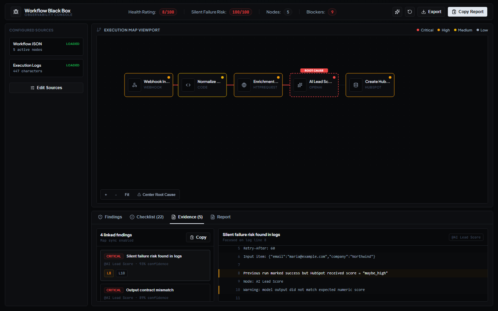

# Workflow Black Box

<p align="center">
  <strong>Diagnóstico visual y agent-ready para automatizaciones que fallan en silencio.</strong><br>
  Detecta riesgos, encuentra root cause y genera reportes accionables a partir de workflows exportados y logs de ejecución.
</p>

<p align="center">
  
  
  
  
  
</p>


## Descripción

Workflow Black Box es una consola de diagnóstico para automatizaciones construidas principalmente con `n8n`, con soporte inicial para exports tipo `Make` y `Zapier`. Permite cargar un workflow y sus logs, visualizar el recorrido de ejecución, detectar nodos sospechosos, estimar riesgo operativo y generar un informe claro para clientes o equipos técnicos.

El proyecto también incluye un servidor MCP por `stdio`, por lo que el mismo motor de análisis puede ser usado por agentes, copilotos o herramientas de automatización sin depender de la interfaz visual.

## Soporte de formatos

| Formato | Estado | Qué espera |
| --- | --- | --- |
| `n8n` | Soporte principal | JSON exportado con `nodes` y `connections`. |
| `Make` | Soporte inicial | Blueprint/JSON con arreglo `flow`. |
| `Zapier` | Soporte inicial | JSON con `steps` o `actions`. |
| Logs | Soporte independiente | Texto pegado o archivo `.log`/`.txt` con errores o señales de ejecución sospechosa. |

Si el JSON está roto o pertenece a un formato no soportado, la app lo marca como blocker en vez de mostrar un diagnóstico limpio falso.

## Qué problema resuelve

Las automatizaciones no siempre fallan de forma obvia. Muchas veces un workflow termina como "exitoso", pero escribe datos incorrectos en un CRM, omite validaciones, duplica registros o rompe silenciosamente por una respuesta inesperada de una API.

Workflow Black Box ayuda a detectar esos riesgos antes de que lleguen al cliente:

- identifica nodos sospechosos;
- marca riesgos de `silent failure`;
- detecta falta de validaciones;
- encuentra errores comunes en logs;
- genera recomendaciones accionables;
- produce un informe listo para compartir con un cliente o equipo técnico.

## Puntos fuertes

| Capacidad | Qué aporta |
| --- | --- |
| Mapa de ejecución | Ayuda a entender rápido dónde se rompe o se degrada un workflow. |
| Root cause visual | Marca el nodo más probable detrás del problema detectado. |
| Análisis de logs | Cruza errores, warnings y patrones de `silent failure`. |
| Evidence Mode | Vincula findings con líneas exactas del log para auditar el diagnóstico. |
| Reporte para cliente | Convierte hallazgos técnicos en un resumen compartible. |
| Servidor MCP | Expone el analizador como herramientas reutilizables por agentes. |
| Docker ready | Permite levantar la app en segundos en cualquier entorno compatible. |

## Funcionalidades

- Importación de workflow JSON.
- Importación o pegado de logs.
- Mapa visual de ejecución con estados de riesgo.
- Resaltado de root cause.
- Inspector interactivo por nodo.
- Filtro de findings al seleccionar un nodo.
- Pestaña de evidencia con líneas de log resaltadas.
- Vinculación entre findings, nodos del mapa y logs.
- Checklist de recomendaciones.
- Reporte exportable y copiable.
- Detección explícita de JSON inválido o formato no soportado.
- Adaptación básica de escenarios `Make` y zaps `Zapier` a un grafo diagnóstico.
- Diseño responsive sin overflow horizontal global.
- Layout del mapa por columnas para reducir solapamientos en workflows medianos.
- Pan/zoom básico del mapa para navegar workflows más grandes.

## Pensado para

- desarrolladores que mantienen automatizaciones críticas;
- agencias que entregan workflows a clientes;
- equipos que necesitan auditar integraciones no-code/low-code;
- builders que quieren demostrar dominio de frontend, producto, Docker y MCP en un proyecto de portfolio.

## Vista del producto


## Evidence Mode

Los findings detectados desde logs quedan vinculados con líneas concretas de evidencia. Al abrir una evidencia, la app sincroniza el nodo del mapa, el finding y el visor de logs para revisar el contexto técnico sin perder trazabilidad.



## Tecnologías

- React
- TypeScript
- Vite
- Lucide React
- Playwright para validación visual

La app corre completamente en frontend. No requiere backend ni claves de API.

## Requisitos

- Node.js `20.19+` o `22.12+`.
- npm.
- Docker, solo si querés usar la imagen de producción local o en servidor.

## Instalación local

```bash
npm ci
```

## Desarrollo

```bash
npm run dev
```

La app queda disponible en:

```text
http://127.0.0.1:5173
```

## Validación local

```bash
npm run build
npm run check:mcp
```

`npm run build` compila TypeScript y genera el frontend estático. `npm run check:mcp` valida el servidor MCP y el motor de análisis.

## Build de producción

```bash
npm run build
```

El resultado queda en `dist/` y puede servirse como sitio estático.

## Guía de deploy

Workflow Black Box tiene dos superficies distintas:

- Frontend web: app React estática servida desde `dist/` o desde Docker/nginx.
- MCP local: servidor `stdio` para agentes, ejecutado con Node. No se expone por HTTP en la imagen Docker.

### Opción 1: Docker local o VPS

Construir la imagen:

```bash
docker build -t workflow-black-box .
```

Ejecutar el contenedor:

```bash
docker run -d \
  --name workflow-black-box \
  --restart unless-stopped \
  -p 8080:80 \
  workflow-black-box
```

Abrir:

```text
http://localhost:8080
```

Comandos útiles:

```bash
docker logs -f workflow-black-box
docker stop workflow-black-box
docker rm workflow-black-box
```

Para actualizar una versión en un VPS:

```bash
git pull
docker build -t workflow-black-box .
docker rm -f workflow-black-box
docker run -d --name workflow-black-box --restart unless-stopped -p 8080:80 workflow-black-box
```

Si el servidor ya tiene nginx o Caddy como reverse proxy, apuntá el proxy a `http://127.0.0.1:8080`.

### Opción 2: hosting estático

Como la app no requiere backend, también puede desplegarse en servicios como Vercel, Netlify, Cloudflare Pages o GitHub Pages.

Configuración típica:

```text
Build command: npm run build
Output directory: dist
```

Para SPAs, configurá fallback de rutas a `index.html`. El `nginx.conf` incluido ya hace esto con:

```nginx
try_files $uri $uri/ /index.html;
```

### Opción 3: servir `dist/` con nginx propio

```bash
npm ci
npm run build
```

Copiá `dist/` al root estático del servidor y usá una configuración equivalente:

```nginx
server {
  listen 80;
  server_name tu-dominio.com;
  root /var/www/workflow-black-box;
  index index.html;

  location / {
    try_files $uri $uri/ /index.html;
  }
}
```

### Deploy del MCP

El MCP está pensado para correr localmente junto al cliente/agente que lo consume:

```bash
npm ci
npm run mcp
```

Configuración ejemplo:

```json
{
  "mcpServers": {
    "workflow-black-box": {
      "command": "npm",
      "args": ["run", "mcp", "--silent"],
      "cwd": "/ruta/al/proyecto/workflow-black-box"
    }
  }
}
```

La imagen Docker sirve solo el frontend estático. Si necesitás MCP en un entorno remoto, ejecutalo como proceso Node separado y conectalo desde un cliente compatible con MCP por `stdio`.

## Uso como MCP para agentes

Workflow Black Box también expone su motor de diagnóstico como un servidor MCP por `stdio`. Esto permite que un agente use el analizador sin abrir la interfaz visual.


> Nota: la imagen Docker sirve el frontend estático. El servidor MCP se ejecuta localmente con Node usando `npm run mcp`.

Ejecutar el servidor MCP:

```bash
npm run mcp
```

Ejemplo de configuración para un cliente compatible con MCP:

```json
{
  "mcpServers": {
    "workflow-black-box": {
      "command": "npm",
      "args": ["run", "mcp", "--silent"],
      "cwd": "/ruta/al/proyecto/workflow-black-box"
    }
  }
}
```

Tools disponibles:

| Tool | Uso |
| --- | --- |
| `analyze_workflow_json` | Analiza un workflow JSON y detecta riesgos estructurales. |
| `analyze_execution_logs` | Analiza logs de ejecución, errores y suspicious successes. |
| `analyze_workflow_with_logs` | Cruza workflow + logs para encontrar root cause, findings y recomendaciones. |
| `generate_client_report` | Devuelve un informe conciso listo para compartir. |
| `list_supported_patterns` | Lista los patrones de riesgo detectados actualmente. |

## Cómo usarla

1. Exportá un workflow de n8n, un blueprint de Make o un JSON de pasos de Zapier.
2. Pegá logs recientes de una ejecución fallida o sospechosa.
3. Revisá el mapa de ejecución.
4. Seleccioná un nodo para abrir el inspector.
5. Leé los findings y el checklist.
6. Copiá o exportá el informe para compartirlo.

## Qué analiza actualmente

El motor de análisis detecta patrones como:

- webhooks sin autenticación evidente;
- llamadas HTTP sin retry/backoff;
- APIs con timeouts o rate limits;
- outputs de IA sin validación de schema;
- código que asume campos siempre presentes;
- acciones de creación que podrían duplicar registros;
- workflows lineales sin rama de validación;
- JSON inválido o formatos no reconocidos;
- logs con errores de credenciales, datos faltantes, `429`, timeouts o contratos de salida inválidos.

## QA realizado

El flujo principal fue validado con:

- workflows reales de n8n descargados desde una colección pública;
- carga por archivo y pegado manual;
- logs con `401`, `429`, timeouts, missing fields y suspicious success;
- Evidence Mode, reporte, export Markdown y copy report;
- Docker/nginx en `http://127.0.0.1:8080`;
- viewport desktop y mobile básico;
- servidor MCP con workflow real + logs.

## Estructura principal

```text
src/
  App.tsx              # Interfaz principal
  styles.css           # Sistema visual y responsive
  samples.ts           # Datos de ejemplo
  lib/
    analyzer.ts        # Motor de diagnóstico local
mcp/
  server.ts            # Servidor MCP por stdio para agentes
```

## Estado del proyecto

Este proyecto es un MVP funcional orientado a portfolio. La base visual, Docker, MCP y diagnóstico local están listos. El soporte más sólido es `n8n`; `Make` y `Zapier` tienen adapters iniciales para estructuras comunes, no cobertura exhaustiva de todos sus exports posibles.

## Assets del repo

- `docs/hero.png`: portada principal del README.
- `docs/architecture.png`: diagrama visual del flujo frontend, motor de análisis y MCP.
- `docs/evidence-mode.png`: captura real de la pestaña de evidencia.
- `docs/social-preview.png`: banner preparado para configurarlo como Social preview en GitHub.

## Roadmap

- Exportar reportes en PDF.
- Ampliar cobertura real de exports de Zapier y Make.
- Historial local de diagnósticos.
- Mejorar pan/zoom para workflows de más de 40 nodos.
- Tests unitarios para `analyzer.ts`.
- Modo demo con varios casos reales anonimizados.

## Licencia

MIT.
